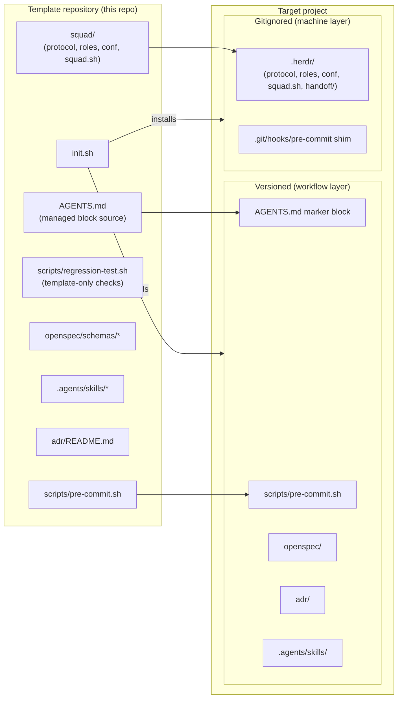
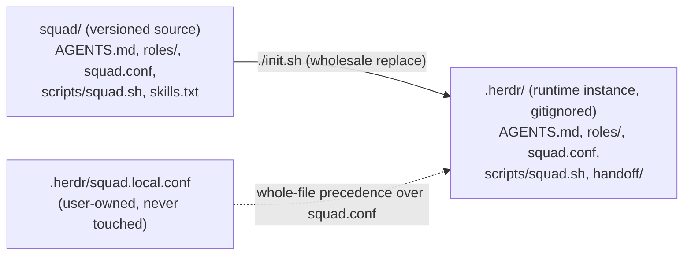
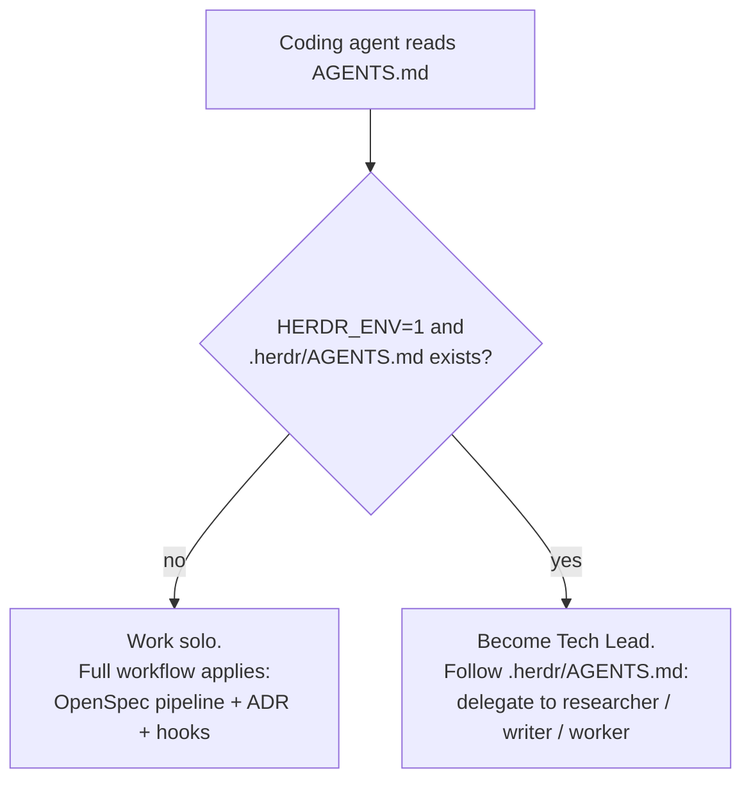
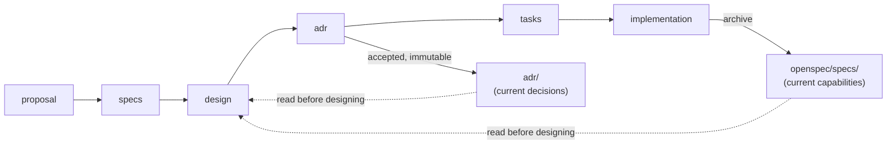
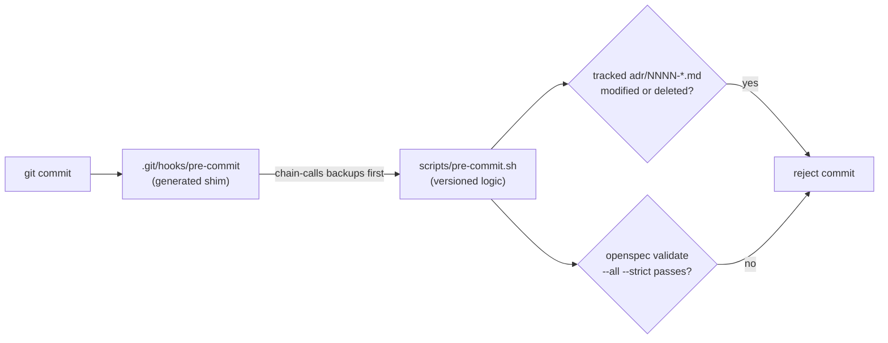
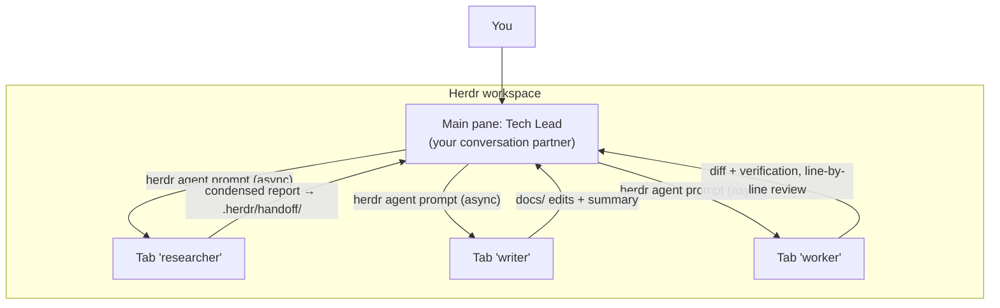

# Architecture

This document explains how copilot-workflow is structured and why. It is for anyone who wants to modify the template itself or understand what installation does to a target project. For usage instructions, see [Getting Started](./getting-started.md).

## System overview

copilot-workflow is a **template repository** plus an **installer**. The installer projects the template into any target project, splitting the payload into two layers with different lifecycles:

Design intent (see [ADR-0001](../adr/0001-workflow-first-positioning.md)):

- **Workflow layer** — versioned with the target project, applies to every collaborator, works with any coding agent, no Herdr required.
- **Machine layer** — the Herdr squad instance and the git hook shim. Restored per machine by rerunning `init.sh`; never enters version control.

## Source / instance split

Squad assets exist in two places with a strict one-way flow (see [ADR-0006](../adr/0006-squad-source-instance-split.md)):

Rules that keep this coherent:

- To change the squad, edit `squad/` source and rerun `./init.sh`; direct edits to `.herdr/` are overwritten by the next install.
- This template repository runs `./init.sh` on itself, so its own `.herdr/` instance exercises the real install path on every iteration (Dogfooding).
- `squad.local.conf` and `handoff/` are user/runtime data inside `.herdr/` that the installer never reads or writes.

## Conditional runtime

The root `AGENTS.md` managed block carries workflow discipline plus a single dispatch decision:

Squad concepts (Tech Lead, roles, delegation protocol) exist only inside `.herdr/AGENTS.md`, so projects without Herdr never see them (see [Squad Guide](./squad-guide.md) for the protocol itself).

## Change pipeline and sources of truth

Large changes flow through the OpenSpec `spec-driven-with-adr` schema; two directories persist across changes (see [ADR-0002](../adr/0002-adopt-openspec-spec-driven-with-adr.md)):

The pre-commit hook mechanizes the two invariants (see [ADR-0004](../adr/0004-git-hooks-enforce-spec-and-adr-discipline.md)):

## Installer behavior

`init.sh` is merge-based, idempotent, and progressive (see [ADR-0003](../adr/0003-merge-based-idempotent-installer.md)):

| Property | Mechanism |
|----------|-----------|
| Merge-based | `AGENTS.md` managed only inside `<!-- copilot-workflow:begin/end -->` markers; pre-existing hooks backed up and chain-called |
| Idempotent | Managed directories are replaced wholesale; `openspec init` reruns to repair generated workflow skills; the manifest records version and managed paths |
| Progressive | Missing git fails fast; missing openspec CLI skips that component with a remediation command; missing jq/herdr only produces a notice |
| Self-install safe | When source and target paths coincide (template repo installing onto itself), managed assets are left alone and only derived artifacts (`.herdr/`) are generated |

The template-only `scripts/regression-test.sh` exercises recovery from a partial OpenSpec initialization and verifies that squad name collisions fail before creating runtime topology. The installer never copies this test harness into target projects.

## Squad topology

At runtime the squad lives inside one Herdr workspace (see [ADR-0005](../adr/0005-single-tech-lead-squad-model.md) and [ADR-0007](../adr/0007-conf-driven-squad-launcher.md)):

One tab per role, named after the role, created by `squad.sh` in the current workspace — no extra workspaces, no split panes. Agent names prefer the bare role name and fall back to `<project-prefix>-<role>` on cross-project collisions.

## Related documentation

- [Getting Started](./getting-started.md) — installation and recovery
- [Engineering Workflow](./workflow.md) — the OpenSpec pipeline in daily use
- [Squad Guide](./squad-guide.md) — squad operation and delegation
